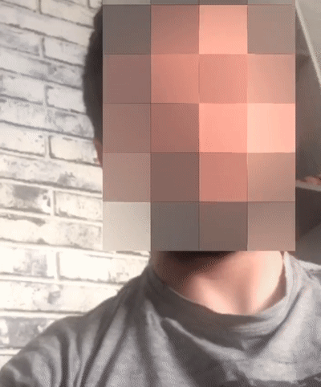

<h1 align="center">

</h1>

# Anonymize Human Faces iOS app Example
Anonymize one of the most sensitive data types - a person's face. Real time in your iOS app. Tutorial for this repository is available [here](https://makeml.app/face-anonymizer-tutorial).

[MakeML](https://makeml.app?from=github_blurface) is a Developer Tool for Creating Object Detection, Semantic Segmentation, and Image Classification Neural Networks without a Line of Code. It's built to make the training process easy to setup. It is designed to handle data sets, training configurations, markup and training processes — all in one place.

## Object Detection + Blurring Human Faces Example with CoreML
Is an iOS project example that can be used to run your own CoreML Object Detection Model with nice blur effect on top of the detection area.

## Train Custom Image Classification CoreML model
[](https://makeml.app)

With MakeML you can prepare dataset and train Object Detection CoreML model with Turi Create frameworks in one application.

<div align="center">

</div>

## Using another .mlmodel in iOS application
[](https://makeml.app)    [](https://makeml.app)

For using this project with another .mlmodel file, add it to the project and change this line with your name of the model.
```
guard let modelURL = Bundle.main.url(forResource: "Model", withExtension: "mlmodelc") else {
    return NSError(domain: "VisionObjectRecognitionViewController", code: -1, userInfo: [NSLocalizedDescriptionKey: "Model file is missing"])
}
```

## Links

[Tutorials](https://makeml.app/tutorials?from=github_blurview) | [MakeML in App Store](https://apps.apple.com/us/app/makeml/id1469520792?mt=12) | [Full Documentation](https://makeml.app/docs/doc1?from=github_blur_view) | [MakeML Chat](https://discordapp.com/invite/vgcG3Su) | [Support page](https://makeml.app/support?from=github_blur_view)
